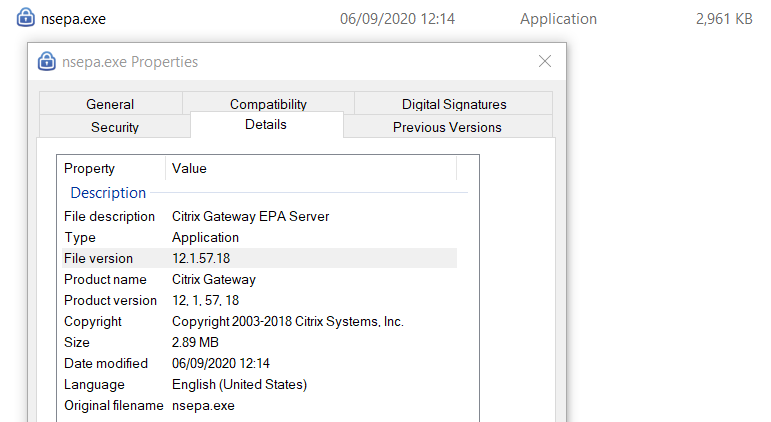

# Citrix

## Citrix NetScaler Gateway

### Fingerprint NetScaler Gateway

Download the following installer:

```
https://{HOST}/epa/scripts/win/nsepa_setup.exe
```

Extract the binary `nsepa_setup.exe\nsepa.msi\nsepa.cab\nsepa.exe` and read the
properties:


