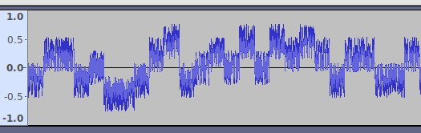
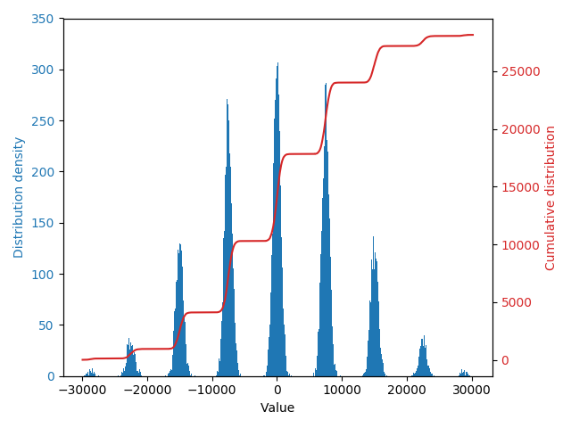

WRITE UP - INS'HACK 2019: CHALLS DONT MATTER ANYMORE
====================================================

This is a write-up for the challs dont matter anymore challenge of INS’hAck 2019 by LarsH on behalf of team HackingForSoju.

## Description
> You’ve definitely pissed off these aliens by breaking their secret transmission methods ! Now they have 8 devices transmitting on the same frequency, using 32-bit synchronous CDMA.
>
> One of the devices is sending unencrypted codes, this is our chance ! The intercepted transmission is in this file.

Attached is the file CDMA_interception.wav.

## Analysis
So we are given the information that the data is sent using CDMA. Several signals can be transmitted with CDMA using orthogonal codes, wikipedia page.

If we look at how the input data looks in Audacity, we can see that the signal seems to be partwise constant in blocks of 100 samples with some noise added.



We can compute the mean value for every time slot and plot.
```python
wav = wavio.read('CDMA_interception.wav')
means = wav.data.reshape((wav.data.size/100,100)).mean(axis=1)
plt.hist(means,bins=1000)
plt.plot(sorted(means),range(len(means)))
```


The mean values for the time slots separate into several distinct groups, depending of what the transmitters send. This is the interference pattern. The first side groups are located at +/-7500, so we can compute the number of the bin by dividing by 7500 and rounding to the nearest integer.

We were given that the transmission uses 32-bit codes, so we can reshape the data into a matrix with 32 columns and find an orthogonal base in that data set. There are several ways, but LLL-lattice reduction worked fine.

```
matrix = (means.reshape((means.size/32,32))/7500.0).round().astype(int)
base = reduceLattice(matrix)
```
This gave 8 base vectors that span the data set. (It was at this stage the smell of flag started to show, as we were given the information that there were 8 devices.) The base was:
```
[ 1, 1, 1, 1,-1,-1, 1, 1,-1,-1, 1,-1, 1,-1,-1,-1, 1,-1,-1,-1,-1,-1, 1,-1, 1, 1, 1, 1,-1,-1, 1, 1]
[-1,-1, 1, 1, 1,-1,-1, 1,-1, 1, 1,-1,-1,-1, 1,-1, 1, 1, 1, 1,-1, 1, 1,-1, 1,-1,-1,-1, 1, 1, 1, 1]
[ 1,-1, 1, 1, 1,-1,-1,-1,-1,-1,-1,-1,-1,-1, 1, 1,-1, 1,-1,-1,-1,-1,-1, 1,-1,-1, 1, 1, 1,-1,-1, 1]
[-1, 1, 1, 1,-1,-1,-1,-1, 1,-1, 1, 1, 1,-1,-1,-1,-1, 1, 1, 1, 1,-1,-1, 1,-1, 1,-1, 1, 1, 1, 1, 1]
[ 0, 1,-1,-1,-1,-2, 1, 2, 0, 2, 0,-2, 0, 0, 0,-1, 3,-1, 2,-1,-1,-1, 3,-3, 0,-2, 0,-1,-1, 0, 1, 0]
[-1, 0, 0, 0,-2, 1, 2,-1, 1,-1, 3, 1, 3,-1,-1, 0, 0,-2,-1, 2, 2, 0, 0, 0, 1, 3, 1, 2, 0,-1, 0, 1]
[-1, 1,-1, 1,-1,-1,-1, 1, 1, 1,-1,-1, 1, 1, 1,-1, 1, 1, 1,-1,-1,-1,-1, 1,-1,-1, 1,-1,-1,-1, 1,-1]
[ 1, 0, 2, 0, 2, 1, 2, 1,-1, 1, 1,-1,-1, 1,-1,-2, 0,-2,-1, 0,-2, 2, 2,-2, 3, 1,-1, 0, 0, 1, 2,-1]
```
We can see that this base is not perfect, as all base vectors should have been 1 or -1. This is because LLL minimizes vectors with the L2-norm, not the L-inf-norm.

But the base was good enough to use, if we just reduce the rawdata after decoding with this base. To decode the data, we take the dot product with the base and reduce again:

```python
rawdata = base.dot(matrix.transpose())
data = reduceLattice(rawdata)
```

## Source code
This script solves the challenge:
```python
import wavio, fpylll, bitarray, numpy

def reduceLattice(lattice):
    A = fpylll.IntegerMatrix.from_matrix(lattice)
    M = fpylll.GSO.Mat(A)
    M.update_gso()
    L = fpylll.LLL.Reduction(M)
    L()
    return numpy.array(map(list, A), dtype=int)

wav = wavio.read('CDMA_interception.wav')

# Compute mean values for every time slot
means = wav.data.reshape((wav.data.size/100,100)).mean(axis=1)

# Convert mean values to integers and reshape into matrix of data
matrix = (means.reshape((means.size/32,32))/7500.0).round().astype(int)

# Get reduced basis for matrix through lattice reduction
base = reduceLattice(matrix)[:8]

# Compute raw data through dot product with basis
rawdata = base.dot(matrix.transpose())

# Reduce raw data more, as base is not perfect
data = reduceLattice(rawdata)

# To through all 8 data streams and print flag if found
for d in data:
    plaintext = bitarray.bitarray(list(d<0),endian='big').tobytes()
    if 'INSA' in plaintext:
        print plaintext
```

Running it gives the flag:
```
$ python solve.py
Oh hi, I see you've found my secret device. Want a flag ? Here you go INSA{Elektr0nenklange_Aus_d3m_R4di0l4nD}
```
