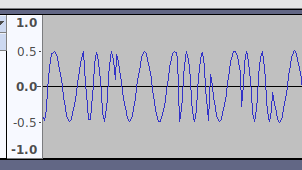
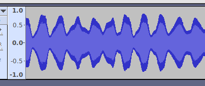

WRITE UP - INS'HACK 2019: LIT FAM
=================================

This is a write-up for the LIT FAM dual challenge of INS’hAck 2019 by LarsH on behalf of team HackingForSoju.

## Description
> We have a proof of extraterrestrial life ! Or is it just a random amateur radio operator ?
>
> Anyway, here is a strange RF interception. The file contains two independent flags

The RF interception was given as a WAV file, and The A-part flag matches INSA{[A-Z]+} and the F-part matches INSA{[A-Za-z0-9_]+}.

## Initial analysis
If we open the WAV file in Audacity and zoom in, we can see that the file consists of sine-waves with two different frequencies. This is called FSK modulation, the changing frequency is used to encode the data.


If we zoom out a bit more, we can see that the amplitude of the FSK signal varies and encodes an analog signal. This is AM, amplitude modulation, the amplitude is used to encode the data.


## Decoding FSK
There are several ways to decode an FSK signal, but as we have a pure sine wave there is a special trick.

The trick is based on the fact that the second derivative of `sin(w*x)` is `-w*w * sin(w*x)`. If we take the second derivative and divide by the original function value we get `-w**2`, so we can extract the time.

We have a sampled sine wave in discrete time `f(n) = A * sin(n*dt*w)`, so we can not get the exact derivative, but we can use approximations and simplifications. It will be enough to decode the data.

The second derivative (ignoring discretization constant) can be approximated with

```
f''(n) = f(n-1) - 2*f(n) + f(n+1) =
       = A * (sin(n*dt*w - dt*w) - 2*sin(n*dt*w) + sin(n*dt*w + dt*w)) =
       = A * (sin(n*dt*w)*cos(dt*w) - cos(n*dt*w)*sin(dt*w) - 2*sin(n*dt*w) + sin(n*dt*w)*cos(dt*w) + cos(n*dt*w)*sin(w*t) =
       = A * (2*sin(n*dt*w)*cos(dt*w) - 2*sin(n*dt*w)) =
       = A * 2 * sin(n*dt*w) * (cos(dt*w) - 1)
```
so the value of f''(n) / f(n) is
```
f''(n) / f(n) = (A * 2 * sin(n*dt*w) * (cos(dt*w) - 1)) / A*sin(n*dt*w) =
              = 2 * (cos(dt*w - 1)
```

This expression only depends on the frequency of the signal, wich is the quantity we want to extract!

We can now decode and plot the raw frequency dependent data:

```python
import wavio
from matplotlib import pyplot as plt
wav = wavio.read('FAM.wav')
l = [(a-2*b+c) / float(b) for a,b,c in zip(wav.data[:500], wav.data[1:], wav.data[2:])]
plt.plot(l)
plt.show()
```


The frequency signal is stable at -0.1 and -0.4, except for at the boundaries where the bit level changes. The bits change every 20th sample, so we can reduce the data set by picking every 20th sample, starting at sample 10. We compute the bit value using 0.25 as a threshold value.

```python
>>> b = [int(e<-0.25) for e in l][10::20]
>>> numpy.array(b[:80]).reshape((10,8))
array([[1, 0, 1, 1, 1, 1, 1, 0],
       [1, 1, 0, 1, 0, 0, 1, 0],
       [1, 1, 0, 1, 1, 1, 0, 0],
       [1, 0, 1, 1, 1, 1, 1, 0],
       [1, 1, 1, 0, 1, 0, 0, 0],
       [1, 1, 0, 1, 0, 0, 0, 0],
       [0, 1, 1, 0, 0, 1, 1, 0],
       [1, 0, 1, 1, 1, 1, 1, 0],
       [1, 0, 0, 0, 0, 0, 1, 0],
       [1, 1, 0, 1, 0, 0, 1, 0]])
```
We can see that the the last bits align nicely and we should be able to decode this as ASCII. However, the challenge creators put in a small trick. The bytes are stored in big endian with only 7 bits given for the first byte. One way to decode the bits is to add a zero to the beginning and decode using bitarray.

## Decoding AM
The simplest circuit to decode an AM signal with is a diode receiver. The digital equivalent is to use the abs() function, we can just write back the rectified data to a WAV-file and listen to it.

## Solution script
This is the final solution script:
```
import wavio, bitarray
wav = wavio.read('FAM.wav')
wavio.write('rectified.wav', abs(wav.data), wav.rate)
l = [(a-2*b+c) / float(b) for a,b,c in zip(wav.data[:10000], wav.data[1:], wav.data[2:])]
print bitarray.bitarray([0]+[int(e<-0.25) for e in l][10::20]).tobytes()
```

Running the script prints the the flag
```
_in_th3_AiR_4_u_4nd_Me}INSA{iS_in_th3_AiR_4_u_4nd_Me}INSA{iS_ih*
```
and if we listen to the file rectified.wav we can hear some space sounds followed by the voice message:

> The flag is I, N, S, A, opening bracket, RADIOACTIVITY, closing bracket. All letters are in uppercase.

so the flag is `INSA{RADIOACTIVITY}.`
